**↖ Snippet of my profile** 
I code and build stuff, sometimes it even works 
Started my coding journey at a young age 
Fully self-taught, learning and building every day 
Exploring different technologies and improving step by step 
 

 

— [instagram](https://instagram.com/bintankdisini) · [tiktok](https://tiktok.com/@hymndavinci) · [telegram](https://t.me/cahay4ngkasa) · [discord](https://discord.gg/dgmK9F2tvc) · [email](mailto:hymndavinci@gmail.com)

