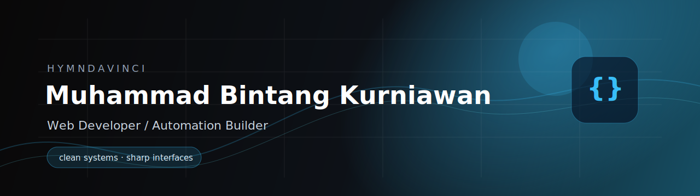
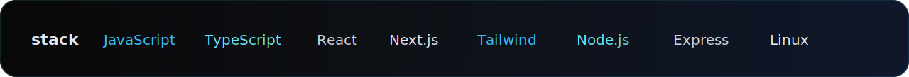
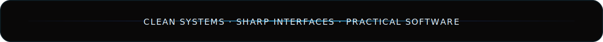

# Hello Connections!

I am **Muhammad Bintang Kurniawan**, a developer focused on building clean web interfaces, practical dashboards, and useful digital systems.

I believe good software should stay readable, modular, and maintainable. My goal is to build practical systems that are easy to use, reliable to run, and clean enough to keep improving.

> [!NOTE]
> Currently working on web dashboards, backend structure, developer workflow, and automation projects under **hymndavinci**.

  

<table border="0">
<tr>
<td width="60%" valign="top">
<h2>Developer Profile Activity</h2>

Currently active in web development, dashboard systems, and developer workflow experiments, focusing on <b>clean interfaces</b>, <b>structured backends</b>, and <b>maintainable tools</b>.

<ul>
<li><b>Building:</b> full-stack web apps, control panels, worker services, and practical utilities.</li>
<li><b>Designing:</b> clean interface systems, responsive layouts, and dashboard experiences.</li>
<li><b>Optimizing:</b> backend structure, API routes, deployment workflow, and runtime organization.</li>
<li><b>Learning:</b> system design basics, Linux workflow, and maintainable architecture.</li>
</ul>

<i>"Build useful systems. Keep the interface clean."</i>

</td>
<td width="40%" valign="top" align="center">
<h2>Discord Profile Activity</h2>

  

</td>
</tr>
</table>

  
  
  

## Lets Connects!~

  
  
  
  
  

  

  

